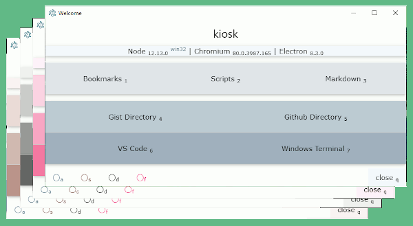

# bookmark-renderer

## 1.0 About

A startup welcome kiosk for **Windows 10**.

> It is basically just a bulky taskbar and markdown viewer. ( *not cross platform* )

> Experimental Linux branch: ```git checkout deb64```, ( Non-Sand boxed Debian x64 )

## 2.0 Install

```ps1
npm install                 <#  ## install all dependencies
                                npm install electron --save-dev
                                npm install marked   --save-dev
                            #>

npm run buildExe            ## just build as a .exe ( for --arch=x64 )

npm run-script shortcuts    ## make desktop shortcut and startup link
```

## 3.0 Functional Features:

    

* Repo File Explorer / Repo File Manager
* Markdown Reader
* Launch shell scripts (```.bat```, ```.ps1```)
    * Enable powershell scripts for current user
        ```ps1
        Set-ExecutionPolicy RemoteSigned -Scope CurrentUser
        ```
* Launch ```.exe``` apps
* Web bookmarks
* Taskbar and Tray Menus

## 4.0 Dependencies

### 4.1 Node Packages

| Package | npm | About |
|---|---|---|
|NodeJS|[download]( https://nodejs.org )| ```npm install npm@latest -g```|
|Electron|[download]( https://www.electronjs.org/ )|Windows 10 ( versions 6 - latest ) |
|marked|[download]( https://www.npmjs.com/package/marked )|markdown to html|
|electron-packager|[download]( https://www.npmjs.com/package/electron-packager )|package electron app as an .exe|

---

### 4.1 CSS Styles

* [github-markdown-css]( https://github.com/sindresorhus/github-markdown-css )
* [w3.css](https://www.w3schools.com/w3css/w3css_color_themes.asp)

## 5.0 Screenshots ( outdated )

* Compressed ```.gif``` rendered [screenshots](screenshots/README.md)
* The latest version has more cosmetic conveniences:
    * more decorative color options
    * taksbar and tray menus
    * decorative favicons
    * more Markdown reader controls

|||
|:---:|:---:|
|||
|||
